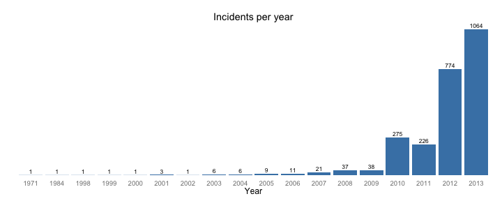
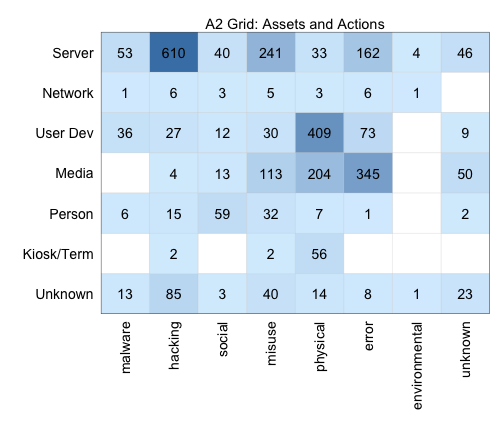

# The VERIS Community Database
Information sharing is a complex and challenging undertaking. If done correctly, everyone involved benefits from the collective intelligence. If done poorly, it may mislead participants or create a learning opportunity for our adversaries. The Verizon RISK Team supports and participates in a variety of information sharing initiatives and research efforts. We continue to drive the publication of the Verizon Data Breach Investigations Report (DBIR) annually, where we have an unprecedented number of new data-sharing partners, and we are committed to keeping the report publicly available and free to download. We regularly receive inquiries about our dataset, and our ability to share further, but we are limited in what data we can share in raw format due to agreements with our partners and customers.

## The Problem
While there are a handful of efforts to capture security incidents that are publicly disclosed, there is no unrestricted, comprehensive raw dataset available for download on security incidents that is sufficiently rich to support both community research and corporate decision-making. There are organizations that collect—and in some form—disseminate aggregated collections, but they are either not in a format that lends itself to ease of data manipulation and transformation required for research, or the underlying data are not freely and publicly available for use. This gap has long hampered researchers who are studying the problems surrounding security incidents, as well as the risk managers who are starved for reliable data upon which to base their risk calculations.

# Getting Involved
If you want to get involved in this project, we have directions in the wiki for this repo.  If you are new to GitHub, it is the book icon to the top of this page section.

# VCDB Statistics

 

 

